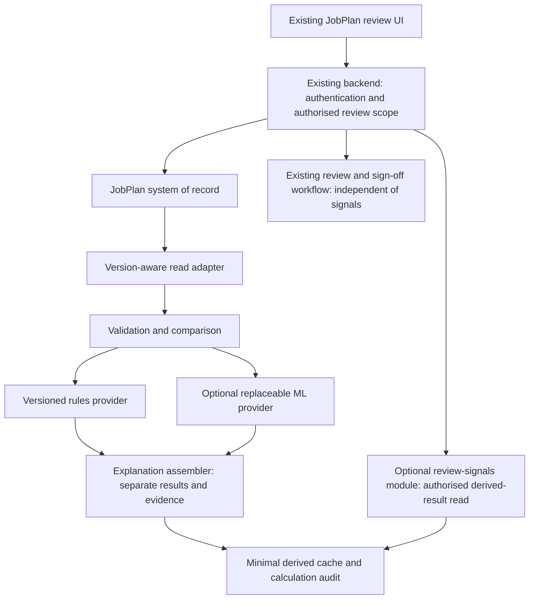

# JobPlan review signals: product integration proposal

**Recommendation:** embed an optional review-signals capability in the existing
JobPlan review worklist, with a small explanation panel in the existing plan
review screen. Start as a module behind the product's existing backend boundary,
not a separate AI product or a new microservice.

**Prioritise attention, not people.**

This is a Product + Architecture + UX + Data/ML presentation, not an integration
specification. The POC repository contains no company source, schemas or data.
A separate read-only architecture review of the product codebase informed the
high-level findings in the "Verified architecture findings" section below; the
detailed evidence is held outside this repository. Where a touchpoint is not
covered by that summary it remains **Requires validation against current
JobPlan implementation**. Endpoint names, flags and derived schemas are
**proposals**, not existing contracts.

## Verified architecture findings (high level, from a read-only review)

These supersede the earlier unverified assumptions wherever they conflict.

- **Stack:** React/TypeScript front end and a .NET API with relational storage,
  a background-job worker and a distributed cache. The Python/Streamlit POC is
  a design aid only; any product version would be rebuilt natively.
- **Worklist shape:** the manager worklist is trust-scoped and paged, with one
  row per clinician (latest plan only), not one row per plan. The POC's per-plan
  queue and the wireframes below are therefore a simplification. Whether signals
  attach to the clinician row or a plan view is an open product decision.
- **Reusable sources:** plan-history snapshots with stable activity identifiers,
  an existing changes report (activities added, modified, deleted) and
  per-category PA value snapshots. These suit rules R-01 to R-03 and part of R-04.
- **Differences from the POC data model:** there are many PA categories, not
  three buckets; PA is computed and plan-level weekly PA may be absent; WTE is
  not part of the plan model; the product has no review-due date, completeness
  percentage or priority concept. Those POC features must not be assumed
  to exist. Dates are date-only or server-local without a time zone, and
  rounding depends on a per-plan setting.
- **"Previous version" needs a product rule:** history rows are written by
  event-driven jobs (a baseline plus per-editor-session updates), so the last
  signed-off plan is not automatically the comparison point.
- **POC gating limitation:** in this POC, any one missing administrative field
  (workflow start, review due date or completeness) withholds all five rules,
  although R-01 to R-05 only need plan-comparison data. A product version should
  separate rule-input sufficiency from optional ML-feature sufficiency. The POC
  engine has deliberately not been changed, so benchmark results stand.
- **Smallest sensible prototype (not approved):** a flag-gated, read-only query
  behind existing authorisation that picks a defined previous version and reuses
  the changes report and category snapshots to return rule evidence as optional
  worklist metadata and a small detail panel. Rules only: no ML, writes, new
  service, cache or job until freshness needs are shown.
- **Open blockers:** previous-version and amendment definitions; row semantics;
  sufficiency of per-row authorisation for derived signals; sourcing of WTE,
  site and unit; history-comparison performance at scale; the amendment target
  and earlier-review rubric remain unvalidated.

The running app's **Product integration** page demonstrates four representative
screens: existing-style and enhanced worklist, existing-style and enhanced
plan review. These are original, fictional wireframes, not copies of the current
product. The presentation switch is not a real feature flag or permission check.
There is no product connection, background service, authenticated endpoint,
production audit, shadow mode or decision-writing capability here.

## 1. Existing problem and current-to-future journey

Assumed task: an authorised Clinical Director already has plans to review and
limited time. The product should help with that task, not ask them to visit an
AI application. The POC shows explainable differences; it has not established
time savings, better decisions or clinical benefit.

| Step | Current-style journey (assumption) | Proposed addition | Unchanged responsibility |
|---|---|---|---|
| Find work | Open existing authorised review worklist | Optional priority, one reason and clarification state | Product determines accessible plans and workflow eligibility |
| Choose next plan | Use existing status/date/order controls | Optional review-priority sort/filter, with ordinary order still available | Reviewer chooses; no plan is excluded solely for a low index |
| Open plan | Existing review/detail route | Small Review signals panel beside/below existing information | Product remains the plan editor/viewer |
| Understand change | Inspect current and historical information | Named source versions, key PA/pattern differences and full comparison link | Reviewer supplies context; legitimate change is not wrongdoing |
| Act | Existing review/sign-off workflow | No new approval/rejection or parallel review task | Existing permissions, validations, confirmation and audit apply |
| Missing information | Use existing clarification route, if one exists | Name the missing comparison item; no invented low priority | Missing comparison never blocks ordinary review/sign-off |

The old workflow above is illustrative, not a verified screen inventory.
Review/sign-off policy, available clarification actions and the correct previous
version selection all require product and clinical-owner confirmation.

## 2. Integration touchpoints and UX specification

| Option | Decision | Minimal change | Validation dependency |
|---|---|---|---|
| A: existing review worklist | Primary integration | Add supportive metadata and optional sorting/filtering | Exact worklist, pagination, normal order, eligibility and scopes |
| B: plan detail/review | Required companion | Compact Review signals panel and comparison disclosure | Existing detail layout, version diff and navigation |
| C: existing reviewer dashboard | Conditional; do not build a new dashboard | Small authorised-scope counts linking to the worklist | Existing dashboard and permission-safe aggregation |
| D: experiment/admin area | Separate evaluation audience | Rules/ML comparison, disagreement, provenance and diagnostics | Existing privileged area and access/audit controls |

**Worklist before:** plan identity, service, current workflow status and review
date. **After:** retain those fields, add Review priority and Main reason.
Priority is metadata, not the identity of the row or a clinician leaderboard.
The wireframe deliberately retains the same three cases and fixed order in
both modes: it demonstrates an additive change, not a fabricated existing sort.

**Detail before:** plan identity, status, current activities and existing review
workflow. **After:** keep those surfaces and add a small Review signals panel:
one reason, changed previous/current values, actual missing information and an
optional full comparison. Reuse the current design-system components and diff
capability if they exist; validate their availability before implementation.

Use text + icon states: Review sooner, Standard review, Data clarification.
The POC maps High to Review sooner and Medium/Low to Standard review. These
illustrative thresholds are not NHS policy or a validated earlier-review rubric.
Do not interpret Standard review as approval or absence of a meaningful change.
Missing previous data may be legitimate for a first plan: clarify the comparison
context, not the clinician's conduct.

Rules-only is a complete product path. In a future approved ML pilot, a separate
Additional experimental signal disclosure may be tested; never silently replace
the rules category or blend indices. Retain a visible method/configuration
reference in detailed evidence. No AI branding or model terms are necessary
on the ordinary worklist.

## 3. What we reuse, derive and add

**JobPlan remains the system of record.** Do not create a second clinician or
JobPlan database. Proposed read adapters must resolve the following meanings,
not assume that the POC's Python fields are product columns.

| Candidate existing information | Use / proposed mapping | Open semantic question |
|---|---|---|
| Tenant, plan ID, version ID, clinician link | Authorised lookup, comparison lineage; identity is not an ML feature | Identifier scope, immutable versions, tenancy enforcement |
| Service/specialty and review scope | Existing display and authorised filtering | Membership at version time versus current membership |
| Current/previous activities and stable activity identity | PA totals, category redistribution, added/removed activities | Recurrence, cancelled activities, matching across versions |
| Categories such as DCC/SPA/Other | Normalised comparison after approved mapping | Trust-specific categories and historical mapping changes |
| PA or time allocations and WTE | Comparable totals and context-adjusted changes | Annualised activity, sessions/hours-to-PA rules, rounding and effective dates |
| Working days/sessions and sites | Pattern and location differences | Timetabled versus non-timetabled work; canonical site identity |
| Version relationship and effective dates | Appropriate previous/current comparison | Previous agreed plan, latest draft or equivalent planning cycle? |
| Workflow status, stage-entry date, due date | Existing workflow display; optional pre-review administrative features | Stage resets, due-date provenance and local workflow configuration |
| Completeness and source-quality indicators | Distinguish unknown from recorded incomplete data | Required fields, legitimate omissions, revision-specific availability |

All candidate source availability and mappings above: **Requires validation
against current JobPlan implementation**. In particular, the POC does not have
a previous-version snapshot date; its current snapshot must not be relabelled.
Never infer that a missing activity was removed or silently convert unknown PA
to zero. Unreconciled units, incomplete versions, ambiguous matches or conflicting
totals withhold affected calculations and the reliable overall priority.

**Derived comparison:** version-pair references, reconciled PA totals and deltas,
category-share deltas, stable-ID additions/removals, WTE/session changes, site
allocation changes and data-quality findings. Exclude outcome/sign-off events
after the calculation cut-off from the pre-review adapter.

**New, minimal derived records (proposal; not the POC export schema):**

| Record | Suggested minimum content |
|---|---|
| ReviewPriority | TenantId, JobPlanId, CurrentVersionId, PreviousVersionId (nullable), SourceRevision/Fingerprint, ComparisonVersion, CalculationVersion, RulesVersion, ConfigVersion, ModelVersion (nullable), CalculatedAt, State, RulesPriority (nullable), DisplayPriority (nullable), DataQualityState |
| ReviewSignal | CalculationId, SignalId, rule/provider source, rule version, typed observed difference/strength, threshold/config reference, evaluated/withheld state, reason code and evidence/version references |
| ModelResult (optional) | CalculationId, ModelVersion, FeatureSchemaVersion, status, model index (nullable), signed explanation metadata/reference and CalculatedAt |

Keep model priority in ModelResult, linked to the same calculation; do not
duplicate it in multiple mutable rows. DisplayPriority is an explicit,
versioned presentation mapping from rules, not a hidden combination of scores.
The API can expose rules and model results separately without persisting a blend.
Do not use a property called Severity to imply clinical harm.

Prefer version references and minimal numeric evidence over full activity or
clinician snapshots. Reconstruct detail from authorised source versions where
retention permits. If exact historical evidence must survive source deletion,
agree a minimal evidence snapshot and retention basis with governance first;
do not promise indefinite replay. A derived cache is rebuildable, not a source
of truth. Calculation identifiers are internal lineage, not new clinical identity.

## 4. Logical architecture and calculation lifecycle



Logical boxes are not deployment services. Start with modules in the existing
backend and its existing background-job/cache infrastructure **if available**.
Do not port Streamlit or assume Python is the product runtime. Port validated
comparison/rule contracts to the host stack, or use an approved internal adapter
only if operational evidence justifies it. ML is a replaceable provider, not
a reason to introduce a separate service.

| Component | Responsibility | Must not own |
|---|---|---|
| Product read adapter | Consistent authorised, tenant-scoped source snapshot and approved unit/category mapping | Source plan edits or new clinician master data |
| Comparison module | Validate and derive version-pair differences with provenance | Workflow decisions or silent imputations |
| Rules provider | Versioned deterministic signals, thresholds and exact points | Model explanations |
| Optional ML provider | Approved pre-review feature schema, model version and exact explanation terms | Product permissions or UI/workflow policy |
| Calculation coordinator | Idempotency, revision checks, retries, atomic result publication | Sign-off availability |
| Explanation assembler | Human-readable reason codes plus faithful evidence, separate method results | LLM-generated rationales or causal claims |
| Backend enrichment reader | Reauthorise, join fresh results into accessible worklist/detail | Expanding review scope |

**Recommended computation:** enqueue after an eligible source/version/configuration
change, with deduplicated jobs and a scheduled reconciliation/backfill for missed
events. Worklist reads use cached/materialised results, not per-row synchronous
model calls. A small bounded synchronous comparison might suit a prototype if
measured latency permits; never gate plan opening/sign-off on it.

Calculation key: tenant + plan + current/previous immutable revisions +
comparison/rules/configuration versions + optional model/feature versions.
Read a consistent source snapshot, calculate, then verify the source/config
revisions still match before publishing atomically. Late jobs cannot overwrite
newer results. Edits, version changes, due-date/completeness updates and applicable
configuration changes invalidate affected results. A late outcome label does not
become a pre-review input.

Store CalculatedAt separately from the source effective time/cut-off. Freshness
is revision-based with an approved maximum age where time-dependent features
require it, not merely "calculated today". Handle out-of-order events, duplicate
jobs and cancellation. Stale/pending results must never appear as current
Standard review. Existing review continues while recalculation is queued.

## 5. Proposed interfaces, not existing APIs

Existing API inventory: **none confirmed**. Candidate existing operations below
are **Existing API — requires confirmation**, not a statement that these URLs
exist. Reuse equivalent existing interfaces rather than duplicate them.

| Status | Candidate/proposed contract | Behaviour |
|---|---|---|
| Existing API — requires confirmation | `GET /jobplans/review-queue` | Existing authorised worklist/filter/pagination; optional enrichment must not widen scope |
| Existing API — requires confirmation | `GET /jobplans/{id}` | Existing authorised plan/version read |
| Existing API — requires confirmation | `GET /jobplans/{id}/previous` | Approved comparison-version resolution; absence is explicit |
| Proposed API | `GET /jobplans/{id}/review-signals` | Authorised, version-bound optional derived result; no source write |
| Proposed internal API, only if host needs HTTP | `POST /internal/review-priority/calculate` | Service-authenticated queue request containing plan/version references, not arbitrary clinical payload |

Prefer an in-process job interface over adding that internal HTTP route.
The POST would return `202` with a calculation reference, use the revision-based
idempotency key, and not allow a browser to force expensive work or choose a
different tenant. GET can report pending until publication. Use existing product
authentication/error conventions; inaccessible plans must not leak existence.

Illustrative **proposed response shape**, unrelated to unchanged POC export v2:

```json
{
  "contractVersion": "proposal-1",
  "jobPlanId": "JP-004",
  "source": {"currentVersion": "JP-004-current", "previousVersion": "JP-004-previous"},
  "calculation": {"state": "pending", "calculatedAt": null, "configurationVersion": "example-config"},
  "rules": {"state": "pending", "index": null, "displayPriority": null, "signals": []},
  "model": {"state": "disabled", "modelVersion": null, "index": null, "explanation": null},
  "dataQuality": {"state": "not_assessed", "findings": []}
}
```

Proposed calculation states: ready, insufficient_data, pending, stale, disabled,
unavailable. Distinguish unavailable infrastructure from insufficient source
information. Ready requires matching source/config revisions and evaluated
required inputs. Non-ready priorities are null, never fabricated zero. A ready
rules result can coexist with a disabled/unavailable model result.

Provider boundary (language-neutral proposal):
`calculate(validatedComparison, versionedConfiguration) -> ProviderResult`.
Rules and ML implement the same orchestration boundary but have distinct typed
explanation spaces. Providers receive no frontend widget state or discretionary
tenant/identity features. A model rejection or missing feature produces a typed
unavailable/insufficient result, not a substitute rules explanation labelled ML.

## 6. Permissions, flags, audit and failure behaviour

Reuse current product authorisation; its exact mechanism is **Requires validation
against current JobPlan implementation**. Flags enable capability, never access.
Enforce tenant and existing reviewer scope before enrichment, sorting, pagination,
counts and detail reads. Recheck on every read, including exports and cached
evidence; revoke visibility immediately when underlying access changes. Do not
fetch all plans then filter only in the browser. Do not expose hidden-plan counts
or ranked IDs. Jobs use restricted service identities and tenant-bound queries;
derived cache keys include tenant, source versions and configuration.

| Proposed flag | Rule | Initial use |
|---|---|---|
| `jobplan_review_prioritisation` | Master opt-in, checked server-side within existing authorised scope | Explicit approved environment/Trust/reviewer cohort allow-list, default off |
| `jobplan_ml_prioritisation` | Requires master; rules remain separate and usable when off | Default off; compare-only before any visible experimental signal |
| `jobplan_review_explanations` | Gates detailed disclosure, not minimum main reason/provenance | Never display unexplained priority if minimum faithful reason is unavailable |

Resolve flags using the existing product framework if available. Distinguish
off, rules-only, rules+ML compare-only, and approved ML-disclosure pilot modes.
Do not enable an ML pilot just because a rules flag is enabled. Flag evaluation
failure defaults the new capability off, logs an operational error and preserves
ordinary workflow. Flag/config versions enter calculation provenance; provide
tenant/global kill switches and test rollback/cache invalidation.

| Condition | Proposed reviewer behaviour | Operational handling |
|---|---|---|
| ML unavailable | Valid rules still show; model unavailable in diagnostics | Bounded timeout, log and monitor; no fabricated model score |
| Whole module/cache unavailable | Ordinary worklist order and review continue; concise "Review signals unavailable" | Log/alert and bounded retry, no success-shaped fallback |
| Previous version missing or inconsistent source | Data clarification with actual missing item; no reliable priority | Route to existing clarification mechanism if confirmed; review remains possible |
| Pending/stale | Calculating/refresh required, not a current priority | Queue retry/recalculation; do not sort old indices as fresh |
| Capability disabled | Existing-style worklist/detail without signals | No new calculation dependency |
| Unauthorised or cross-tenant request | Existing access-denial policy, no derived evidence | Existing security audit; never reveal a cached priority |

Audit calculation ID/time, source version references/cut-off, validation findings,
feature/config/rules/model versions, provider states and signals produced. A
separate exposure event can record the calculation/priority actually shown,
viewer/scope and time under approved minimisation/retention. Calculation is not
exposure; viewing a signal is not a formal decision. Existing workflow audit
continues to record actual reviewer actions. Never use this telemetry as a
clinician-performance score or a reviewer-surveillance leaderboard.

## 7. ML experiment and safety boundary

The POC target is **synthetic material amendment after review**, NOT independently
assessed earlier-review need. It learns generator behaviour, not real historical
clinical norms. Default K=30 on the common 128 eligible/25-positive synthetic
holdout gives rules 8, ML 6, oldest-first 7; random mean 5.76 over 100 seeded
permutations. The app's Experiment results remains the evaluator-driven source.
Presentation fixtures are excluded from training/evaluation.

ML has not demonstrated an advantage here. Keep RulesPriority and MLPriority
separate; compare equal-budget selections, overlap/disagreement, precision/recall
where defined and repeated random/chronological controls. Undefined metrics stay
unavailable. No blended score, calibrated real-world probability, causal effect,
clinician-quality label or clinical-safety prediction is supported.

Before product testing, agree an independent earlier-review/clarification rubric,
outcome timing and adjudication. Prevent temporal/entity and post-review leakage;
fit transformations on training data only. Check subgroup/configuration coverage,
missingness, stability and drift. Observe review time, comprehension, anchoring,
over-reliance and override reasons with consent; do not invent numerical targets.
ML must clear both incremental utility and human-factors/governance gates.
Rules-only may be the final product choice.

## 8. Productisation path and assurance gates

| Stage | Scope | Gate / exit evidence | Not permitted yet |
|---|---|---|---|
| 0: current POC + this presentation | Synthetic-only, standalone representation | Source reconciliation, explanation tests, understandable proposal | Real product/data connection or benefit claim |
| 1: controlled prototype (proposed) | Approved representative JobPlan-shaped adapter/mock interface, no production writes | Product/API mapping, version semantics, permissions threat model, failure and contract tests | Silent production rollout |
| 2: shadow mode (proposed) | Approved real data; outputs withheld from production reviewer ordering | Legal basis/access/minimisation, independent rubric, prospective temporal/entity checks and subgroup review | Workflow influence or automatic decisions |
| 3: controlled pilot (proposed) | Selected Trusts/reviewers, explicit rules-only/ML comparison cohorts | Pre-agreed usefulness/usability measures, baseline comparison, human override, monitoring and rollback rehearsal | Broad rollout or assumed ML promotion |
| 4: product capability (conditional) | Supported optional feature | Evidence-backed Product/clinical/governance/engineering approval, operational ownership and monitoring | Automatic approval/rejection or clinician assessment |

Agree thresholds and success measures before study; no dates or target
percentages invented. Retain a control/ordinary-worklist path. Roll back the
new feature without rolling back JobPlan or preventing review.

QA must cover tenant/role revocation, inaccessible count leakage, duplicated and
out-of-order jobs, version/config races, cache invalidation, all failure states,
source reconciliation, missing comparisons, valid large WTE changes, score/reason
fidelity, ML-off equivalence, keyboard/screen-reader/reflow behaviour and ordinary
review/sign-off independence. These are proposed product assurance tests, not
claims that this unauthenticated POC has implemented RBAC or production resilience.

## 9. Ten-section presentation and 5–7 minute storyboard

| Time | Slide/section | Show / say |
|---|---|---|
| 0:00–0:30 | 1. Existing user problem | Many plans, limited reviewer attention; no proven benefit yet |
| 0:30–1:00 | 2. Current-style workflow | Product integration, Existing-style worklist; clearly label it an assumption |
| 1:00–1:40 | 3. Proposed enhancement + 4. Before/after | Switch on proposed signals: same cases, same workflow, extra reason/clarification metadata |
| 1:40–2:30 | 5. Detail integration | Open JP-004; compare modes. Current activities remain, small signals panel is added |
| 2:30–3:00 | 6. How it works | Source versions → validation/comparison → separate rules/optional ML → faithful explanation |
| 3:00–3:30 | 7. Product boundaries | Open JP-005; missing comparison is not low priority, and ordinary review remains available |
| 3:30–4:15 | 8. ML experiment | Experiment results: actual equal-budget comparison; ML need not win |
| 4:15–5:15 | 9. Technical integration | Module + existing jobs/cache, proposed read contract, RBAC reuse and non-blocking failures |
| 5:15–6:30 | 10. Productisation path | Validation questions, shadow-before-pilot gates, owners and evidence needed |

End: "JobPlan could help reviewers decide where to focus, explain the change,
and leave the decision in its existing workflow. We can validate rules value
without committing the product to ML."

## 10. Questions and final product test

No answers to these questions are assumed:

| Owner to consult | Question / decision required |
|---|---|
| Product/UX | Where is the current reviewer worklist implemented? Which roles use it and how do they choose the next plan? |
| Engineering/security | How are tenant, reviewer role and plan scopes represented and revoked? |
| Data/product | Are immutable historical versions available? Which previous version is clinically/workflow appropriate? |
| Data/domain | How are activities, stable IDs, PA/category units, annualisation, WTE and local Trust differences represented? |
| Architecture | What JobPlan APIs already exist, and is comparison/version-diff already supported? |
| Product/clinical | How does sign-off work, and what existing clarification/override actions are legitimate? |
| Platform | What feature-flag framework, job scheduler and cache infrastructure exist? Can calculations run asynchronously? |
| Governance/data | What data may legally and appropriately be used for ML, under what retention/access restrictions? |
| Product/data | Which Trust configurations affect mappings, thresholds, due dates or completeness? |
| UX/design system | Which current components, terminology and accessibility patterns can be reused? |
| Platform/assurance | What audit/analytics/monitoring exists, and who owns incidents, recalculation and kill switches? |
| Clinical/research | What independently reviewed outcome/rubric establishes usefulness beyond the synthetic amendment target? |

**Product:** targets an assumed existing review-selection task; confirm it with
users. **UX:** illustrates an additive panel/worklist enhancement; native fit
is not verified without the actual product/design system. **Architecture:**
proposes optional enrichment, never a sign-off dependency. **Data:** keeps the
source of truth in JobPlan with minimal derived lineage. **ML:** supports a fair
comparison, not proof of value. **Responsible AI:** leaves every decision with
the authorised reviewer. **Productisation:** offers conditional stages, not a
commitment to deployment. The next decision is to validate product touchpoints
and the review rubric, not to deploy the POC architecture.
